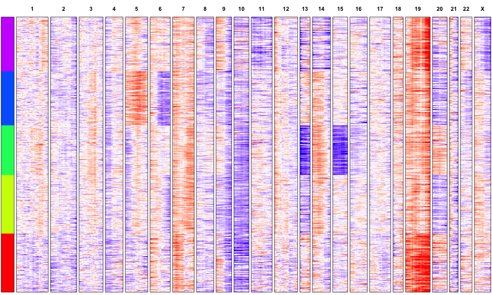

# Overview
Inferring large copy number variations from single cell RNA-seq data  

Method described in [Single-cell RNA-seq highlights intratumoral heterogeneity in primary glioblastoma, Patel et al. Science, 2014 (Fig. 1c)](http://www.sciencemag.org.ezp-prod1.hul.harvard.edu/content/344/6190/1396.full)  

Goal is to recreate figure 1c  
  
# Data Source

## Bulk Normal

GTex RNA-seq gene read count downloaded January 17, 2014 from the [GTEx datasets portal](http://www.gtexportal.org/home/datasets)  

GTex IDs were also downloaded January 17, 2014 for all tissue sites with 'Brain' in name from the [GTEx portal](http://www.gtexportal.org/home/samplesPage)  

## Single Cell

Single cell SRA files were downloaded August 1, 2014 from [GEO](http://www.ncbi.nlm.nih.gov/geo/query/acc.cgi?acc=GSE57872)/[SRA (ftp)](ftp://ftp-trace.ncbi.nlm.nih.gov/sra/sra-instant/reads/ByStudy/sra/SRP/SRP042/SRP042161)  

Additional IDs/identifiers were also downloaded August 5, 2014 to map SRR run names to cell names used in the paper from the [SRA Run Selector](http://www.ncbi.nlm.nih.gov/Traces/study/?acc=SRP042161)  

## Data Processing

SRA files were converted to FASTQ format on August 4, 2014 using SRA toolkit (sratoolkit.2.3.5-2). FASTQs were aligned using Tophat2 (tophat-2.0.10) and quantified using HTSeq (HTSeq-0.5.4) on August 4, 2014.   

Counts for both bulk normal and single cells were assembled into RData matrices on August 7, 2014   

Error models and FPM values were derived using the [SCDE package](http://pklab.med.harvard.edu/scde/Tutorials/). ([Paper](http://www.ncbi.nlm.nih.gov/pubmed/24836921) and [Download](http://pklab.med.harvard.edu/scde/index.html)) 

# Folder Contents

## RData/
- FPM values derived from SCDE for bulk and single cells (fpm_bulk.RData and fpm.RData) 
- Note: FPM values for bulk have been pre-filtered to reduce file size

## scripts/
- script recreating figure 1c (cnv_analysis.R)

## results/
- original plot from Patel paper (fig1c.png)
- recreation (cnv.png)

# Results

Cell sample orderings are a little different, but generally the same trends are recapitulated! 

